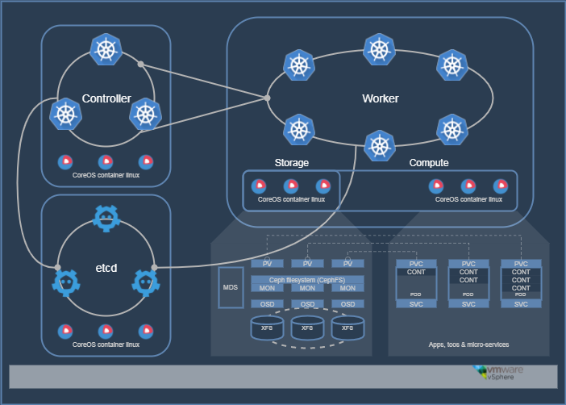

Install Kubernetes running on CoreOS hosted in vSphere using PowerCLI
===
This guide walks a deployer though lauching a produciton ready multi-node Kubernetes cluster in a VMware infrastructure using VMware vSphere PowerCLI and CoreOS. After compreting this guide, a deployer will be able to interact with the Kubernetes API from their workstation using the `kubectl` CLI tool.

Optionnaly, guidelines to create a ceph storage cluster inside kubernetes to the persistent storage need of stateful containers.



# Test environement

* VMware vSphere `6.5` standard (ESXi and vCenter)
* CoreOS Container Linux `stable 1409.2.0`
* Kubernetes `1.6.6`
* Ceph-Docker `Kraken`

# RoadMap

* [x] Relies on existing Kubernetes install scripts.
* [x] Function to update virtual hardware configuration
* [x] Option to add additionnal disk
* [x] Test Vmware Tools running state instead of start-sleep
* [x] Test SSH port availability instead of start-sleep
* [x] Functions to return `etcd`, `controller`, `worker` address list
* [x] Download / Update CoreOS Container Linux OVA if internet access available
* [ ] Option to test service availability
* [ ] Option to export vSphere VM specifications in CliXml format

# Prerequisites

The `K8s-vSphere` Powershell modules hardly depends on Windows Powershell 5.O features, vSphere PowerCLI 6.3 and Git Bash.

Navigate to the following download page to grabe the appropriate software download pages.

* [.Net Framwork 4.5.2](https://support.microsoft.com/en-us/help/2901907/microsoft-.net-framework-4.5.2-offline-installer-for-windows-server-2012-r2,-windows-8.1,-windows-server-2012,-windows-8,-windows-server-2008-r2-sp1,-windows-7-sp1,-windows-server-2008-sp2,-and-windows-vista-sp2)
* [Windows Management Framework](https://msdn.microsoft.com/en-us/powershell/wmf/5.1/release-notes)
* [Git for Windows](https://git-for-windows.github.io/)
* [VMware vSphere Power CLI](https://code.vmware.com/web/dp/tool/vsphere_powercli/6.5)

## Administrative permission

Deployer must own Administrative permissions on the workstation in order ton install the required software packages required. 

**Windows Powershell must runs as an Administrator**. 

## Chocolatey

Chocolatey is an advanded software package manager similar to nuGet and brew (MacOS).
It will be used to install the various software pre-requisites to run the deployment scripts

## Windows Management Framework 5.1

If WMF version 5.0 or later is not installed. Run the following command line in `Windows Powershell` command prompt running as an Administrator.

```powershell
choco install powershell
```

Navigate to the [Windows Management Framework 5.x downloads page]() and grabe the appropriate package for your system. Install the WMF update before continuing. 

## Install Git for Windows

Git for Windows is required to genereate the SSL asset a

## vSphere PowerCLI 6.3

The Powershell Mo

## Internet Access


# Machine specification

Machine type   | Qty | Hostname prefix | CPU | Memory | Subnet      | Subnet CIDR | Ip start from | Default Gateway | Additionnal Disk | DNS Servers 
-------------- | --- | --------------- | --- | ------ | ----------- | ----------- | ------------- | --------------- | ---------------- | -----------
**etcd**       | 1   | k8setcd            | 1   | 512   | 192.168.1.0 | 24          | 50            | 192.168.1.254   | 4GB, 5GB 6GB     |
**controller** | 1   | k8sctrl            | 1   | 1024   | 192.168.1.0 | 24          | 100           | 192.168.1.254   | 4GB, 5GB 6GB     |
**worker**     | 1   | k8swork            | 1   | 1024   | 192.168.1.0 | 24          | 200           | 192.168.1.254   | 4GB, 5GB 6GB     |

# SSH user

* **username**: k8s-vsphere
* **password** : K8S-vsph3r3


# Troubleshooting

## VMware Guestinfo Interface 
Open an an SSH session to the host then run the following commands to check the GuestInfo properties processed by Clound-Init.

```bash
/usr/share/oem/bin/vmtoolsd --cmd "info-get guestinfo.coreos.config.data"
/usr/share/oem/bin/vmtoolsd --cmd "info-get guestinfo.coreos.config.data.encoding"
```

## Cloud-Init

Execute the following command to retreive the ephemeral `coreos-cloudinit-*.service` responsible of the kublet installation

systemctl list-units | grep

systemctl status $(systemctl list-units | egrep "coreos\-cloudinit\-.*\.service" | awk '{print $1}')


